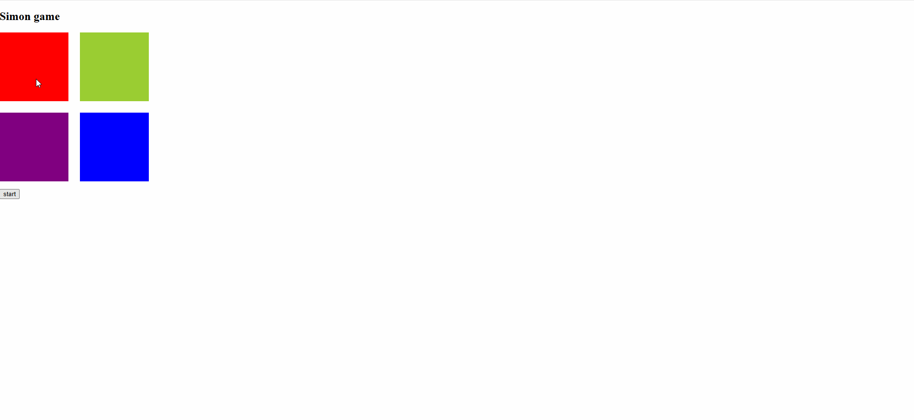

# SimonGame

## About
Pattern matching game where I attempted to make make states of some variables remain unchanged for some periods of time. This why, when bot is making moves, all game cells are disabled and users cannot click on them. 

## What I learnt
-Utilized sleep and async to block and disable some UI element from receiving events from users. 
 
-Managed complex array signals that contained custom objects with set.

## Demo

